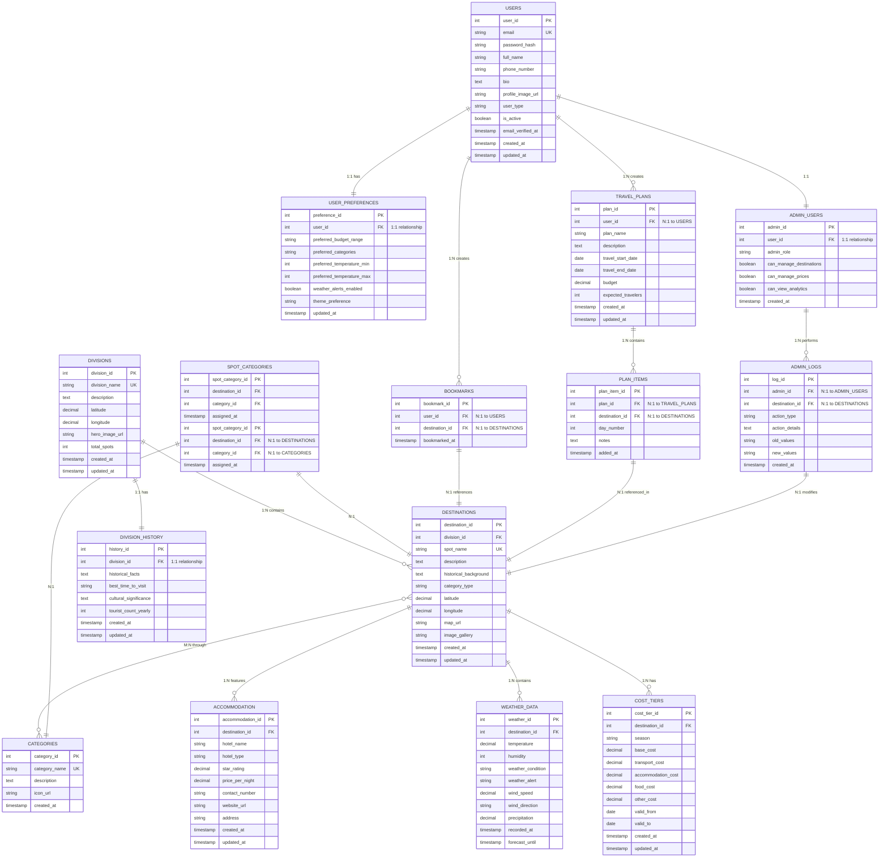

# Ghuri-Phiri: Database Schema Diagram

## Project Overview
**Ghuri-Phiri: A Smart Tourist Guide & Budget Planner for Bangladesh**

A comprehensive web application that provides centralized information about tourist destinations across Bangladesh with integrated travel cost estimation, real-time weather alerts, and smart filtering capabilities.

---

## Database Architecture Diagram

**Relationship Legend:**
- `||--||` = One-to-One (1:1)
- `||--o{` = One-to-Many (1:N)  
- `}o--o{` = Many-to-Many (M:N)

---

## Key Table Summary

| Table Name | Purpose | Primary Entity |
|---|---|---|
| **DIVISIONS** | Administrative regions in Bangladesh | Division |
| **DESTINATIONS** | Tourist spots and attractions | Tourist Spot |
| **CATEGORIES** | Destination types (Beach, Hill, Heritage) | Category Type |
| **SPOT_CATEGORIES** | Many-to-many junction table | Relationship |
| **ACCOMMODATION** | Hotels and lodging options | Hotel/Resort |
| **COST_TIERS** | Seasonal pricing information | Cost Management |
| **WEATHER_DATA** | Real-time weather conditions | Weather Info |
| **DIVISION_HISTORY** | Historical and cultural facts | Division History |
| **USERS** | User accounts and profiles | User Account |
| **USER_PREFERENCES** | User settings and preferences | User Settings |
| **BOOKMARKS** | Saved favorite destinations | Bookmark |
| **TRAVEL_PLANS** | User itineraries and plans | Travel Plan |
| **PLAN_ITEMS** | Destinations within a plan | Plan Item |
| **ADMIN_USERS** | Admin accounts and roles | Admin Account |
| **ADMIN_LOGS** | Audit trail of admin actions | Audit Log |

---

## Key Relationships Summary

| Source Table | Target Table | Relationship | Type |
|-------------|-------------|-------------|------|
| DIVISIONS | DESTINATIONS | One Division has Many Destinations | 1:N |
| DIVISIONS | DIVISION_HISTORY | One Division has One History | 1:1 |
| DESTINATIONS | SPOT_CATEGORIES | One Destination has Many Categories | N:N |
| CATEGORIES | SPOT_CATEGORIES | One Category has Many Destinations | N:N |
| DESTINATIONS | ACCOMMODATION | One Destination has Many Hotels | 1:N |
| DESTINATIONS | COST_TIERS | One Destination has Many Cost Tiers | 1:N |
| DESTINATIONS | WEATHER_DATA | One Destination has Many Weather Records | 1:N |
| USERS | USER_PREFERENCES | One User has One Preference | 1:1 |
| USERS | BOOKMARKS | One User has Many Bookmarks | 1:N |
| DESTINATIONS | BOOKMARKS | One Destination has Many Bookmarks | 1:N |
| USERS | TRAVEL_PLANS | One User has Many Plans | 1:N |
| TRAVEL_PLANS | PLAN_ITEMS | One Plan has Many Items | 1:N |
| DESTINATIONS | PLAN_ITEMS | One Destination in Many Plans | 1:N |
| USERS | ADMIN_USERS | One User is One Admin | 1:1 |
| ADMIN_USERS | ADMIN_LOGS | One Admin makes Many Logs | 1:N |
